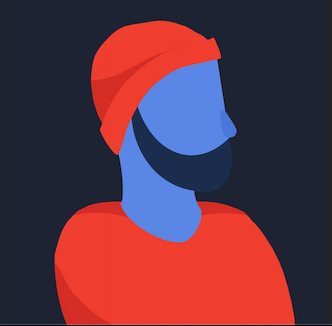

My name is André and I am a full stack developer with a previous career in business, that allows me to translate business needs to the technology world.

I am also a web development teacher focused on trying to make the web easier for the my students.

I have had the fortune of working with clients in the United States, Germany, Portugal, and Wales.

Most of my clients have been focused on e-commerce. Wether to create a store from scratch or redesigning previous stores with new technology stacks and platforms.

### Hi there 👋! 

My name is André and I am a full stack developer with a previous career in business, that allows me to translate business needs to the technology world.

I am also a web development teacher focused on trying to make the web easier for the my students

I have had the fortune of working with clients in the United States, Germany, Portugal, and Wales.

Most of my clients have been focused on e-commerce. Wether to create a store from scratch or redesigning previous stores with new technology stacks and platforms.

 
 

[][n] 

[][p] 

[n]: https://itstheandre.com
[p]: https://itstheandre.com/projects

- ⚡ Fun fact: I do really like wearing a beanie

<!--
**itstheandre/itstheandre** is a ✨ _special_ ✨ repository because its `README.md` (this file) appears on your GitHub profile.

[][s]

https://github.com/itstheandre/itstheandre-v2/blob/d910d7d1ce274226077c10e0b01d81cf4c866f44/public/images/about/dark-hero.png
- 🔭 I’m currently working on ...
- 🌱 I’m currently learning ...
- 👯 I’m looking to collaborate on ...
- 🤔 I’m looking for help with ...
- 💬 Ask me about ...
- 📫 How to reach me: ...
- 😄 Pronouns: ...
- ⚡ Fun fact: ...
-->

